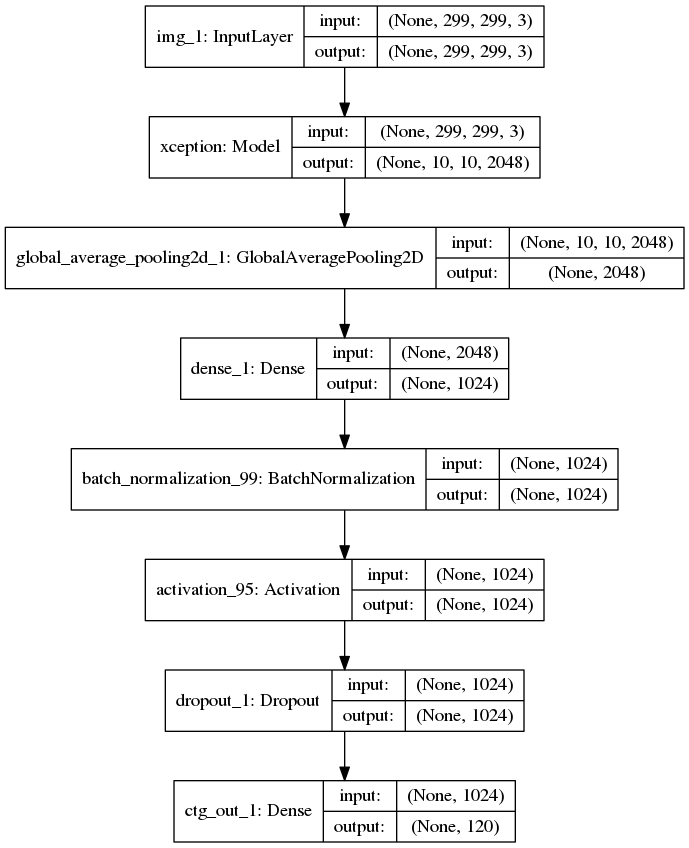
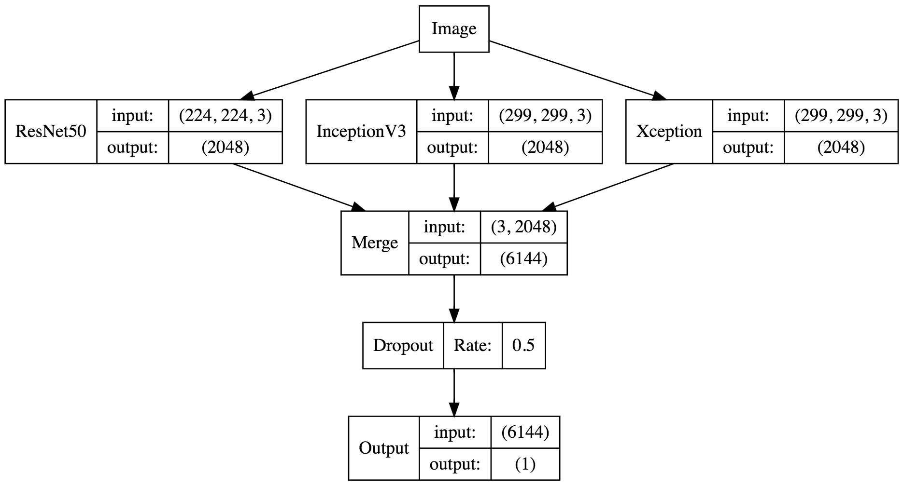
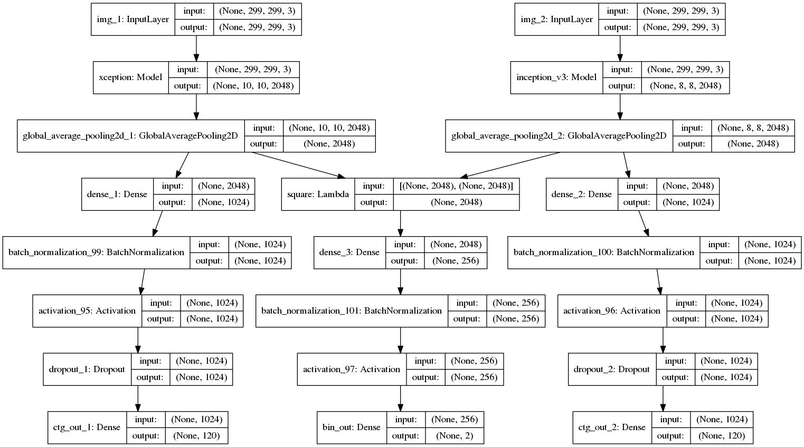

# Kaggle-dog-breed-classification

> author: [fenglf](https://github.com/fenglf)

**Star this repository if you find it helpful, thank you!**

## About
This is the baseline of [Kaggle-dog-breed-classification](https://www.kaggle.com/c/dog-breed-identification/) on Python, Keras, and TensorFlow. 
- name: [fenglf](https://www.kaggle.com/fenglf)
- rank: [tied 1st](https://www.kaggle.com/c/dog-breed-identification/leaderboard)

## Framework
- [Keras](https://keras.io/)
- [Tensorflow Backend](https://www.tensorflow.org/)

## Hardware
- Geforce GTX 1050ti 4G
- Intel® Core™ i5-7400 CPU
- Memory 16G

## Implemented in Keras
 The repository includes 3 ways to build classifier:
* single_model_finetune: Classify with single model finetuning. 
* gap_train: Classify with concatenating multiple models.
*  pair_train: Classify with pair of images and pair losses (Category loss plus Binary loss).
### Data prepare
You can strongly improved the performance of classifier with external data [Stanford dog datasets](http://vision.stanford.edu/aditya86/ImageNetDogs/).
### Train
#### Single_model_finetune
Fine-tune Convolutional Neural Network in Keras with ImageNet Pretrained Models
- Choose a base model, remove the top layer and initialize it with ImageNet weights no top.
- Add fully-connected layer to the last layer.
- Freeze all the base model CNN layers and train the new-added fc layer.
- Unfreeze some base model layers and finetune.

#### gap_train
Train with concatenating multiple ImageNet Pretrained Models' bottle-neck feature in Keras.
- Choose several models, remove the top layer and initialize them with corresponding ImageNet weights no top.
- Extract their bottle-neck features by data (including train data and test data) moving forward the models.
- Concatenate the bottle-neck features of train data.
- Add fully-connected layer to train a classifier.

#### pair_train
Train with pair of images and pair losses (Category loss plus Binary loss) inspired by [the idea in Person Re-id](https://arxiv.org/abs/1611.05666).

- Choose 2 different models or just one model, remove the top layer and initialize them with corresponding ImageNet weights no top.
- Input two images, containing same or different (positive or negtive samples) labels, Which means whether two images belong to same class or not. In each batch, we can find some samples with the same class. So we simply swap those samples to construct positive samples.
- Freeze all the base model(s) CNN layers, train the full connected layers for category and binary classification.
- Unfreeze some base model(s) layers and finetune.

## Code
- Single_model_finetune
  - Train: [train.py](single_model_finetune/train.py)
  - Preditc: [predict.py](single_model_finetune/predict.py)
- gap_train
  - Write bottle-neck feature: [write_gap.py](gap_train/write_gap.py)
  - Gap_train: [gap_train.py](gap_train/gap_train.py)
  - Gap_predict: [gap_predict.py](gap_train/gap_predict.py)
- pair_train
  - Pair_train: [pair_train.py](pair_train/pair_train.py)
  - Pair_predict: [pair_predict.py](pair_train/pair_predict.py)

## Todos

 -  Center loss

## Reference
- [ahangchen/keras-dogs](https://github.com/ahangchen/keras-dogs)

- [freelzy/Baidu_Dogs](https://github.com/freelzy/Baidu_Dogs)

- [q5390498/baidu_dog](https://github.com/q5390498/baidu_dog)
> If you find some bug in this code, create an issue or a pull request to fix it, thanks!

**Star this repository if you find it helpful, thank you!**
